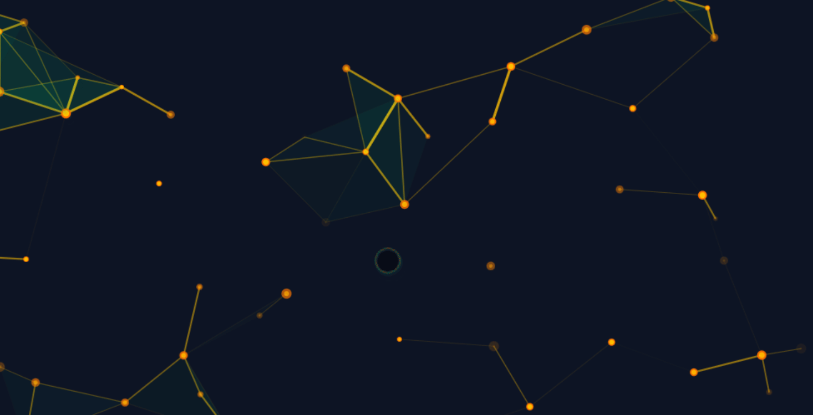

## Description

Plexus is an interactive graph animation that creates a dynamic network visualization. The animation consists of moving vertices (nodes) that connect to form edges and triangular faces. As vertices move across the canvas, edges appear and fade based on the distance between vertices, creating an organic, flowing network effect.

**Note:** JSDoc comments and description in this project were generated by AI.

## How it works

- **Vertices**: Randomly positioned points that move across the canvas with random velocities
- **Edges**: Lines connecting nearby vertices with transparency based on distance
- **Faces**: Triangular shapes formed by three connected edges, creating filled areas
- The animation continuously updates and renders, creating a mesmerizing plexus effect
